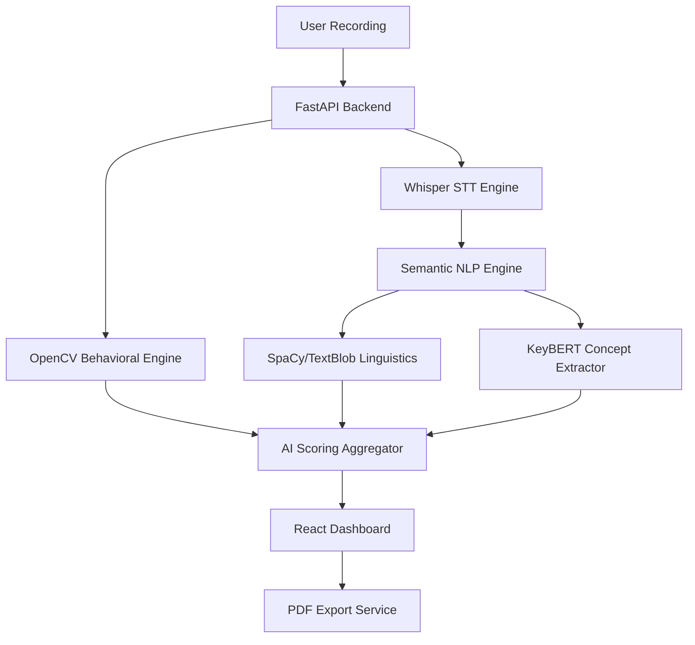

# 🤖 AI Multimodal Interview Intelligence System

A high-fidelity, production-grade AI platform that provides deep-dive analytics for mock interviews using **Multimodal AI**. The system analyzes video behavior, speech patterns, and technical semantic accuracy in real-time.

---

## 🌟 Key Features

### 🧠 Semantic NLP Intelligence
- **Semantic Scoring**: Uses `all-MiniLM-L6-v2` to evaluate answer accuracy against "Golden Answers" via vector similarity.
*   **Concept Coverage**: Extracts technical keywords using `KeyBERT` to ensure core concepts are mentioned.
*   **Java-Free Grammar**: Advanced structural linguistics using `SpaCy` and `TextBlob` (no Java required!).
*   **Tone & Confidence**: Detects uncertainty markers vs. high-authority vocabulary.

### 🎥 Behavioral Computer Vision
*   **Eye Contact Stability**: Monitors visual engagement and gaze consistency.
*   **Presence Analysis**: Ensures professional head-and-shoulders framing.
*   **Motion Stability**: Detects excessive movement or fidgeting using Euclidean distance tracking.
*   **Distraction Detection**: Identifies off-screen focus or multiple individuals.

### 📊 Professional Analytics Dashboard
*   **Radar Proficiency Charts**: Unified visualization of Technical, Behavioral, and Communication metrics.
*   **Filler Word Frequency**: Bar charts tracking crutch words (um, uh, actually).
*   **Vocabulary Cloud**: Highlights related vs. off-topic complex terminology.
*   **Actionable Roadmap**: AI-generated step-by-step improvement plan.

---

## 🛠️ Tech Stack

- **Frontend**: React (Vite), TailwindCSS, Recharts, Lucide Icons.
- **Backend**: FastAPI (Python), Uvicorn.
- **AI Models**: 
  - **Whisper (Small)**: High-accuracy speech-to-text with accent priming.
  - **SentenceTransformers**: For semantic vector embeddings.
  - **KeyBERT**: For keyword/concept extraction.
  - **SpaCy**: For linguistic structural analysis.
- **Computer Vision**: OpenCV, Haar Cascades.

---

## 🚀 Getting Started

### 1. Prerequisites
- Python 3.9+
- Node.js & npm
- **FFmpeg**: Required for video processing (Add to your System PATH).

### 2. Backend Setup
```bash
cd backend
python -m venv interview_env
.\interview_env\Scripts\activate
pip install -r requirements.txt
python -m spacy download en_core_web_sm
uvicorn main:app --reload --port 8001
```

### 3. Frontend Setup
```bash
cd frontend
npm install
npm run dev
```

---

## 📐 Architecture



---

## 📄 License
This project is licensed under the MIT License - see the LICENSE file for details.

---

## 🤝 Acknowledgments
- OpenAI for the Whisper model.
- Hugging Face for the Sentence-Transformers.
- The React & Recharts community for the amazing visualization tools.
